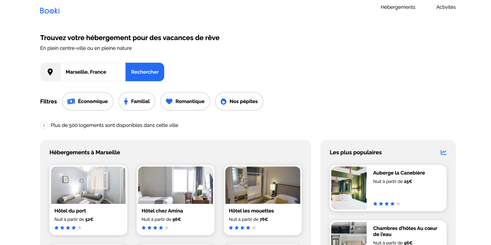

# Projet d'intégration du site web Booki

Ce projet consiste à intégrer le site web Booki, une plateforme en ligne permettant aux utilisateurs de rechercher et de réserver des hébergements pour leurs vacances.

[explorer le code source](https://github.com/raphaelsanchez/oc-p2-booki) - [voir le résultat de l'intégration](https://raphaelsanchez.design/oc-p2-booki/)

## Aperçu du projet



Le but de ce projet est d'intégrer le site web Booki en utilisant les technologies suivantes :

- **HTML** : pour structurer le contenu du site web.
- **CSS** : pour le style et la mise en forme des éléments.

## Structure du projet

Le répertoire du projet est organisé de la manière suivante :

```
/
├── css/
│   ├── style.css
├── images/
│   ├── activites/
│   ├── hebergement/
│   └── logo/
├── favicon.ico
├── index.html
└── README.md
```

## Approche "Atomic" du CSS

Dans ce projet, j'ai adopté l'approche **Atomic Design** de _Brad Frost_ pour organiser le code CSS de manière modulaire et évolutive. L'Atomic Design est un concept qui divise les composants d'une interface en cinq niveaux distincts, du plus petit au plus grand, en les comparant aux atomes, aux molécules, aux organismes, aux templates et aux pages. Cette méthode de conception facilite la création d'interfaces cohérentes et permet une gestion plus efficace du code CSS.

### Structure de l'Atomic Design pour le CSS


1. **Atoms** : Les atomes sont les éléments de base de l'interface, tels que les couleurs, les typographies, les boutons, les formulaires, etc. Chaque atome est un composant réutilisable qui peut être utilisé à plusieurs endroits dans le projet.

2. **Molecules** : Les molécules sont des composants plus complexes créés en combinant plusieurs atomes. Par exemple, un formulaire de recherche peut être considéré comme une molécule composée d'un champ de recherche (atome), d'un bouton de recherche (atome), etc.

3. **Organisms** : Les organismes sont des composants encore plus grands et autonomes qui regroupent plusieurs molécules et/ou atomes pour former des sections plus significatives de l'interface. Par exemple, une carte d'hébergement pourrait être un organisme composé d'une image (atome), d'un titre (atome), d'une description (atome) et d'un bouton de réservation (atome) combinés avec une icône de localisation (atome) et une liste de commodités (atome).

4. **Templates** : Les templates représentent la structure générale de pages spécifiques, en assemblant plusieurs organismes ensemble. Par exemple, un template de page de résultats de recherche pourrait inclure une en-tête, une liste d'hébergements (organismes), et une pagination (atome).

5. **Pages** : Les pages correspondent aux instances finales du projet, où les templates sont complétés par des données réelles pour former des pages web complètes. Par exemple, la page d'accueil (index.html) et la page de réservation (booking.html) sont des pages spécifiques. Étant donnée que ce projet exercice ne comporte qu'une seule page, cette dernière partie n'est pas utilisé.

### Avantages de l'Atomic Design pour le CSS

L'utilisation de l'approche Atomic Design pour le CSS présente plusieurs avantages :

- **Réutilisabilité** : Chaque atome, molécule ou organisme est conçu pour être réutilisable, ce qui permet de maintenir une cohérence visuelle dans tout le projet.

- **Maintenabilité** : L'organisation modulaire du code CSS rend plus facile la gestion et la maintenance de l'ensemble du projet. Les modifications ou les ajouts peuvent être effectués de manière ciblée sans affecter d'autres parties du site.

- **Scalabilité** : L'Atomic Design facilite la création de nouveaux composants en combinant les éléments existants, ce qui rend le projet CSS scalable et évolutif.

- **Collaboration** : L'approche Atomic Design favorise la collaboration entre les designers et les développeurs, car elle permet de décomposer l'interface en composants compréhensibles par toutes les parties prenantes.

### Utilisation dans ce projet

Dans le dossier `css/`, vous trouverez le fichier `style.css` organisés selon la structure de l'Atomic Design. Les styles pour les atomes, molécules et organismes spécifiques à Booki sont regroupés dans des sections respectivement nommés atoms, molecules, et organisms.

L'approche Atomic Design pour le CSS améliorera la maintenabilité, la réutilisabilité et l'évolutivité de ce projet d'intégration de Booki.

## Utilisation des "Custom Properties" CSS (Variables CSS)

Dans ce projet, j'ai exploité les "Custom Properties" (également appelées variables CSS) pour permettre de faire descendre des propriétés du parent vers l'enfant au sein de la hiérarchie des composants. Les "Custom Properties" sont des variables définies au niveau du sélecteur racine (:root) ou de tout autre élément spécifique, et elles peuvent être utilisées n'importe où dans la feuille de styles.

L'utilisation de "Custom Properties" offre plusieurs avantages :

1. **Facilité de mise à jour** : Lorsqu'une propriété, comme une couleur ou une taille, doit être appliquée à plusieurs endroits dans le projet, il suffit de mettre à jour la valeur de la variable pour que tous les éléments liés à cette variable soient mis à jour automatiquement.

2. **Héritage des propriétés** : En définissant des "Custom Properties" au niveau des éléments parents, les enfants peuvent hériter de ces propriétés sans avoir besoin de les redéfinir explicitement. Cela facilite la gestion de la cohérence visuelle dans tout le projet.

3. **Flexibilité** : Les "Custom Properties" peuvent être définies dynamiquement via JavaScript, ce qui permet de modifier les styles en temps réel en fonction des interactions de l'utilisateur ou des préférences.

L'utilisation judicieuse des "Custom Properties" peut améliorer considérablement la maintenabilité et la flexibilité du code CSS, en permettant de créer un système de design cohérent et évolutif.

## Instructions d'utilisation

1. Clonez le dépôt : `git clone https://github.com/votre-utilisateur/booki-integration.git`
2. Ouvrez les fichiers HTML dans votre navigateur pour afficher la page d'accueil du site.

## Avertissement

Ce projet est réalisé à des fins éducatives dans le cadre d'un exercice d'intégration. Booki est une plateforme fictive et toute ressemblance avec un site web existant est purement fortuite.

## Auteur

Ce projet a été réalisé avec amour par _Raphael Sanchez_.
